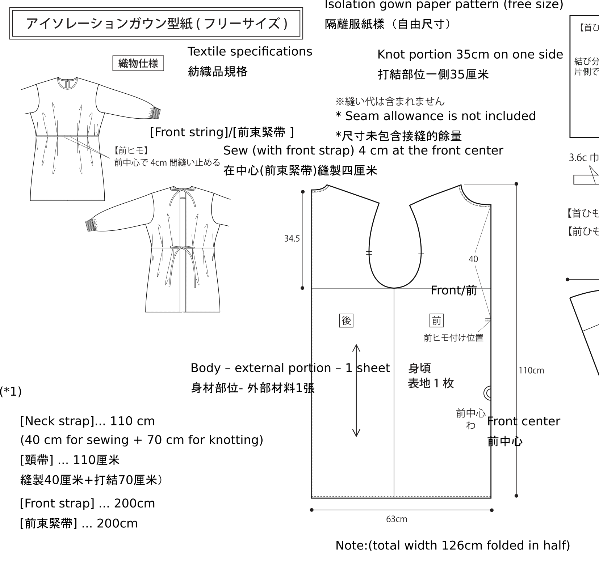

# gowns
information about gowns 

purpose:  to understand and investigate ways to make gowns available for healthcare workers.

materials, sewing methods, design...

start 18th April 2020.  work plan:  Trial with bin liners and ironing/sewing/tape

--- 
Trial 1:  using bin liners and join with tape and/or sewing.  

Material including two 50L liners as body and one 30L bin liner as sleeve.  
Procedure as follows:

a.  Cut the liners according to the 

reference:

1. remarks on using markdowns in github.  https://en.wikipedia.org/wiki/Markdown

