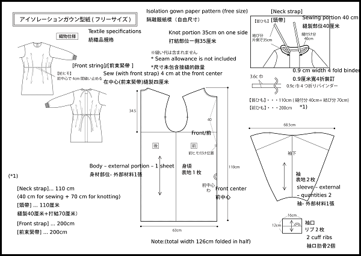
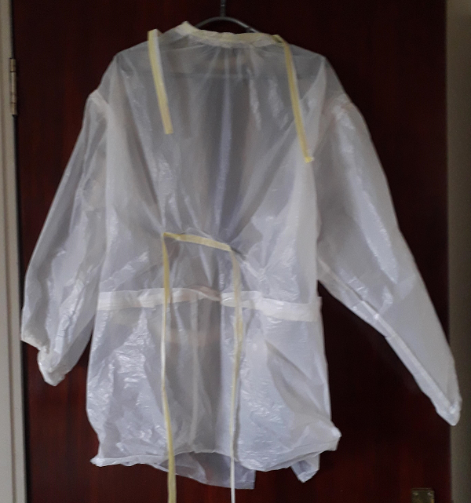

Isolation Gowns
===============
information about gowns 

purpose:  to understand and investigate ways to make gowns available for healthcare workers.

materials, sewing methods, design...

start 18th April 2020.  work plan:  Trial with bin liners and ironing/sewing/tape

--- 
Trial 1:  using bin liners and join with tape and/or sewing.  
============================================================

Material including two 50L liners as body and one 30L bin liner as sleeve.  
Procedure as follows:

a.   Pattern of isolation gown:  

Note that you may need two 50L liners to form the body portion and need adhesive tape to join them together, for instance, one as upper part and the other as lower part.  

Mark the liner piece with the above pattern, allowing 1cm and 3cm extra width for edges where the piece would be join with other edges.  Cut the liners according to the marks.

Use the drawing strings in the liner, fold them in two and sew along to form two straps:  one 110cm for neck strap, and another 200 cm long for the body strap.    

b.  join the sleeve to the body with adhesive tape, like stationary clear tape or painter's masking tape.  It may helps to use a round cylindrical object to hold the position of the sleeve in perpendicular to the body.  I use a 19cm diameter (8") baking tin for cake.  Otherwise a plastic bin may do the same trick.  Apple tape to the seam like this .

complete to join the upper edges of sleeve.

Take a elastic loop with 16 cm perimeter.  Fold the end of the sleeve to contain the loop and secure the cuff with sewing or adhesive tape.   

c.  Use tape to join the shoulder portion of the body. 

c.  Sew the neck strap to the upper edge of the body

d.  sew the neck strap to the centre front the body.

e.  check if there is any openings before packing.

outcome of the trial
--------------------

However there are issues to be resolved:
  * it takes too long to make as film plastic liner is difficult to set in position for applying adhesive tapes or sewing.  Cannot use pins but clips.
  * the liner is thin and easily tear off and wear out when subject to shear force.
  

reference:

1. remarks on using markdowns in github.  https://en.wikipedia.org/wiki/Markdown
